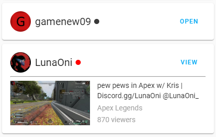
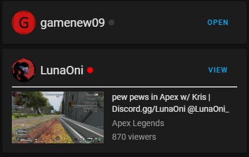

# Twitch Card by [@gamenew09](https://www.github.com/gamenew09)

A Lovelace card that lets you display a Twitch streamer's status and stream info.

 

## Requirements
Requires that you have the [ha_twitch_helix](https://github.com/Radioh/ha_twitch_helix) sensor installed and that the sensors are under the `twitch` domain.

## To-Do

 - [x] Show Channel Avatar, Name, and Live status
 - [x] Allow for opening twitch stream (by default, if `tap_action` is not specified)
 - [x] Show stream title, game, and view count

I can't think of anything else to add, that's needed (create an issue if you want a specific feature)

## Options

| Name              | Type    | Requirement  | Description                                 | Default             |
| ----------------- | ------- | ------------ | ------------------------------------------- | ------------------- |
| type              | string  | **Required** | `custom:twitch-card`                   |
| name              | string  | **Optional** | Card name                                   | `entity.name`       |
| entity            | string  | **Required** | Home Assistant entity ID.                   | `none`              |
| tap_action        | object  | **Optional** | Action to take on tap                       | `action: url` |
| hold_action       | object  | **Optional** | Action to take on hold                      | `none`              |
| double_tap_action | object  | **Optional** | Action to take on double tap                | `none`              |

## Action Options

| Name            | Type   | Requirement  | Description                                                                                                                            | Default     |
| --------------- | ------ | ------------ | -------------------------------------------------------------------------------------------------------------------------------------- | ----------- |
| action          | string | **Required** | Action to perform (more-info, toggle, call-service, navigate url, none)                                                                | `url` |
| navigation_path | string | **Optional** | Path to navigate to (e.g. /lovelace/0/) when action defined as navigate                                                                | `none`      |
| url             | string | **Optional** | URL to open on click when action is url. The URL will open in a new tab                                                                | `none`      |
| service         | string | **Optional** | Service to call (e.g. media_player.media_play_pause) when action defined as call-service                                               | `none`      |
| service_data    | object | **Optional** | Service data to include (e.g. entity_id: media_player.bedroom) when action defined as call-service                                     | `none`      |
| haptic          | string | **Optional** | Haptic feedback _success, warning, failure, light, medium, heavy, selection_ | `none`      |
| repeat          | number | **Optional** | How often to repeat the `hold_action` in milliseconds.                                                                                 | `none`       |